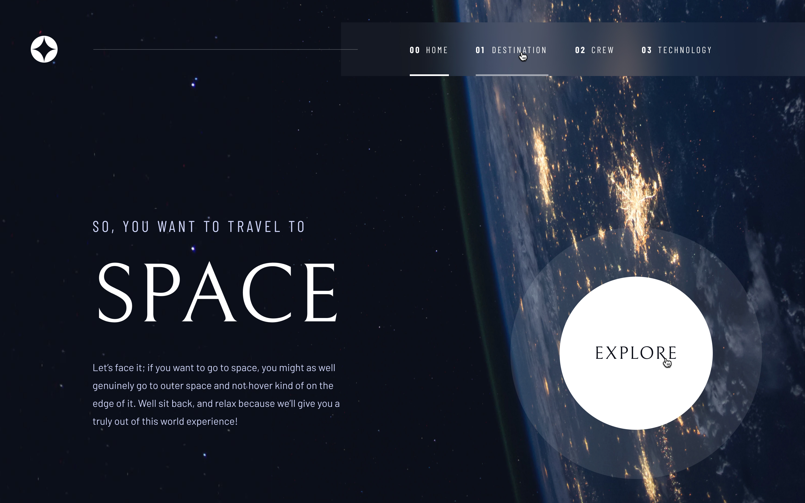

# Frontend Mentor - Space tourism website

## The challenge

Your challenge is to build out this multi-page space tourism website and get it looking as close to the design as possible.

You have to use a JS-heavy approach, we provide a local `data.json` file for the different page data. This means you'll be able to pull the data from there instead of using the separate `.html` files.

Your users should be able to:

- View the optimal layout for each of the website's pages depending on their device's screen size
- See hover states for all interactive elements on the page
- View each page and be able to toggle between the tabs to see new information

## Where to find everything

Your task is to build out the project to the design file provided. We provide both Sketch and Figma versions of the design, so you can choose which tool you prefer to use. You can download the design file on the platform. The design download comes with a `README.md` file as well to help you get set up.

All the required assets for this project are in the `/assets` folder. The assets are already exported for the correct screen size and optimized. Some images are reusable at multiple screen sizes.

The [designs](https://www.figma.com/file/9gfxfUKstrQWHBboxJ4rYg/space-tourism-website?node-id=0%3A1) will give you more information about the various colors, fonts, and styles used in this project.

## Building your project

Feel free to use any workflow that you feel comfortable with. Below is a suggested process, but do not feel like you need to follow these steps:

1. Initialize the codebase as a public repository on [GitHub](https://github.com/). Creating a repo will make it easier to share your code with the community if you need help. If you're not sure how to do this, [have a read-through of this Try Git resource](https://try.github.io/).
2. Configure your repository to publish your code to a web address. This will also be useful if you need some help during a challenge as you can share the URL for your project with your repo URL. There are a number of ways to do this, and we provide some recommendations below.
3. Look through the [designs](https://www.figma.com/file/9gfxfUKstrQWHBboxJ4rYg/space-tourism-website?node-id=0%3A1) to start planning out how you'll tackle the project. This step is crucial to help you think ahead for CSS classes to create reusable styles.
4. Before adding any styles, structure your content with HTML. Writing your HTML first can help focus your attention on creating well-structured content.
5. Write out the base styles for your project, including general content styles, such as `font-family` and `font-size`.
6. Start adding styles to the top of the page and work down. Only move on to the next section once you're happy you've completed the area you're working on.

